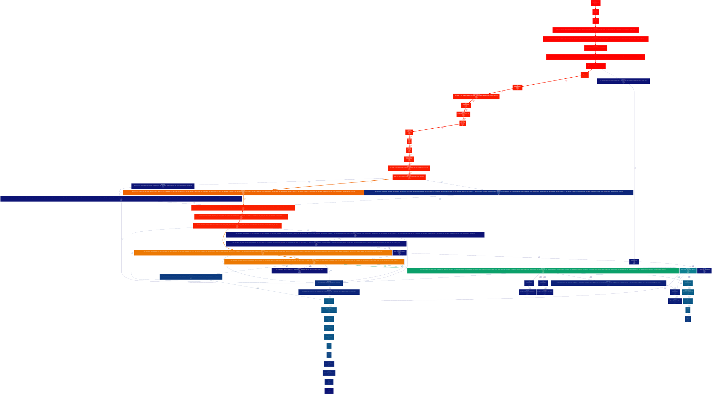

# Performance Report: Aurum TCP Ping Benchmark

## 1. Overview
This report analyzes the performance bottlenecks of the Aurum TCP Ping implementation. The goal is to identify hotpaths and operations that consume excessive CPU time or execution cycles, which will be useful for prioritizing optimizations.

The analysis was performed using the `BM_TCP_Ping_Throughput` benchmark, profiled with `valgrind --tool=callgrind` and visualized via `gprof2dot` and Graphviz.

## 2. Profiling Setup
*   **Compiler Optimization**: `Release` build (`-O3 -march=native -flto`).
*   **Profiler Tool**: `valgrind --tool=callgrind`
*   **Benchmark Command**: `./benchmarks --benchmark_filter=BM_TCP_Ping_Throughput/1024$`

## 3. Results & Callgrind Hotpaths

The top functions by execution cost (Instruction References - Ir) are as follows:

1.  **`boost::asio::detail::read_op<...>` (approx. 19.75% of instructions)**
    *   **Description**: This is the underlying Boost.Asio read loop processing incoming TCP frames within `aurum::tcp_session::read_body()`.
    *   **Impact**: Heavy network read overhead, likely constrained by individual `boost::asio::read` operations rather than batched syscalls.

2.  **`aurum::protocol::base_builder::get_data()` (approx. 17.91% of instructions)**
    *   **Description**: This method inside the protocol payload builder heavily processes data layout.
    *   **Impact**: Nearly 18% of execution time is spent here. This implies vector reallocations, memory copies (`std::memcpy`, `std::vector::insert`), and heavy byte manipulation logic are occurring synchronously during benchmark request handling.

3.  **Memory Management (malloc / free / operator new) (approx. > 20% of instructions combined)**
    *   **`_int_malloc` / `malloc` / `operator new`**: ~14-15% of instructions.
    *   **`_int_free` / `free` / `operator delete`**: ~8-9% of instructions.
    *   **Impact**: Dynamic heap allocation is causing severe thrashing. `std::vector` resizes inside `aurum::protocol::response_builder`, or excessive allocations for responses per TCP session, greatly hinder throughput. Replacing frequent dynamic allocations with pre-allocated memory pools or stack-based operations should be a primary target.

4.  **Data movement / memmove / memset (approx. 7% of instructions)**
    *   `__memcpy_avx_unaligned_erms` (~4.2%)
    *   `__memset_avx2_unaligned_erms` (~2.7%)
    *   **Impact**: Moving arrays in memory internally, possibly inside `aurum::protocol::base_builder::get_data()` and `_M_range_insert` (which accounts for ~3.6% alone).

## 4. Visual Analysis (Call Graph Flame Chart)

The call graph visualizes the profiling data, coloring blocks from Red (highest cost) to Blue (lowest cost).

*(A high-resolution `perf_flame_chart.png` and `callgrind.out` trace are also included in the repository for detailed offline analysis).*

## 5. Recommended Action Items

1.  **Optimize `base_builder::get_data()`**:
    *   Avoid vector copies/insertions where possible.
    *   Implement `std::vector::reserve` aggressively or switch to a more zero-copy memory structure (`boost::asio::const_buffer` chaining) to serialize headers and body lengths directly into the TCP socket write queue.

2.  **Mitigate Heap Allocations**:
    *   Review `aurum::tcp_session` and `aurum::handlers::get_ping_handler()`. The lambda wrapper processing responses allocates heap memory excessively.
    *   Look into reusing a session-local buffer for reading and writing instead of allocating a new `std::vector` per request or frame.

3.  **Optimize Network I/O**:
    *   Investigate `boost::asio::read` and `boost::asio::write` calls. Consider switching from small synchronous reads/writes to larger asynchronous batch operations.
